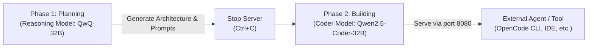

# MLX-Man ⚡

[-black?logo=apple&style=flat-square)](https://apple.com)
[](https://github.com/ml-explore/mlx)
[](https://python.org)
[](LICENSE)

```
███╗   ███╗ ██╗      ██╗  ██╗           ███╗   ███╗  █████╗  ███╗   ██╗
████╗ ████║ ██║      ╚██╗██╔╝           ████╗ ████║ ██╔══██╗ ████╗  ██║
██╔████╔██║ ██║       ╚███╔╝   ██████╗  ██╔████╔██║ ███████║ ██╔██╗ ██║
██║╚██╔╝██║ ██║       ██╔██╗   ╚═════╝  ██║╚██╔╝██║ ██╔══██║ ██║╚██╗██║
██║ ╚═╝ ██║ ███████╗ ██╔╝ ██╗           ██║ ╚═╝ ██║ ██║  ██║ ██║ ╚████║
╚═╝     ╚═╝ ╚══════╝ ╚═╝  ╚═╝           ╚═╝     ╚═╝ ╚═╝  ╚═╝ ╚═╝  ╚═══╝
```

**MLX-Man** is a terminal UI manager and runner for local Large Language Models (LLMs) on macOS Apple Silicon using Apple's [MLX](https://github.com/ml-explore/mlx) framework.

> [!IMPORTANT]
> **What is MLX-Man?**
> MLX-Man is a **local model manager and runner**, **not** an AI agent. It downloads, inspects, organizes, optimizes RAM for, and hosts open-weight models locally on Apple Silicon. You can run interactive terminal chats or host an OpenAI-compatible API server (`http://localhost:8080/v1`) that your external coding tools and agents (such as OpenCode CLI, Continue, or custom agent scripts) can connect to.

---

## 🌟 Highlights

- **100% Local & Private**: All weights, activations, and inferences run on-device via Apple unified memory. Zero telemetry, zero external cloud calls.
- **Spotlight-Style Centered TUI**: A zero-flicker, floating terminal interface powered by Rich and raw terminal mode, designed with macOS dark-mode aesthetics.
- **Task-Oriented Model Roles**:
  - 🧠 **Reasoning / Thinking**: Deep chain-of-thought models for complex planning, architectural design, and problem decomposition.
  - 🔨 **Builder / Coding**: SWE-bench and coding specialists for multi-file implementation, refactoring, and code review.
  - ⚡ **General Purpose**: Balanced models and MoE (Mixture of Experts) architectures for everyday tasks.
- **Thinker → Builder Sequential Swap Workflow**: Maximize Apple Silicon unified memory (e.g. 32 GB) by running a reasoning model to formulate plans, then swapping to a builder model for code implementation.
- **Interactive RAM Cleaner**: An Apple Silicon-aware process manager that scans memory-heavy applications and frees up unified memory before running large models.
- **Complete Model Management**:
  - Detailed architecture inspection (layers, heads, hidden dimensions, quantization).
  - Accurate disk footprint calculations with Hugging Face cache scanning.
  - In-flow Hugging Face downloads by repo ID or URL.
  - Safe deletion with automatic orphaned blob reclamation.
- **OpenAI-Compatible Local Server**: Run any model as an API endpoint on `localhost:8080` with native Apple Silicon MLX GPU acceleration.

---

## 🖥️ System Requirements

| Requirement | Recommended Specification |
|-------------|---------------------------|
| **Architecture** | Apple Silicon Mac (M1, M2, M3, M4, M5, M6 / Pro / Max / Ultra) |
| **Operating System** | macOS 14.0 (Sonoma) or newer |
| **Python** | Python 3.10, 3.11, or 3.12 |
| **Unified Memory** | • **16 GB RAM**: Light models (~8 GB RAM: 14B 4-bit)<br>• **32 GB RAM**: Medium/Heavy models (~14–18 GB RAM: 24B–32B 4-bit)<br>• **64 GB+ RAM**: Heavy models (27B 6-bit, 35B MoE, 70B+) |

---

## 🚀 Quick Start

### 1. Clone the Repository

```bash
git clone https://github.com/gabrielsscavalcante/mlx-man.git
cd mlx-man
```

### 2. Create and Activate a Virtual Environment

```bash
python3 -m venv .venv
source .venv/bin/activate
pip install -r requirements.txt
```

### 3. Launch MLX-Man

```bash
./start_llm.sh
```

> [!TIP]
> The launcher script `./start_llm.sh` automatically detects `.venv` in the project directory, an active virtual environment, or a custom environment specified by the `MLX_VENV` variable (`export MLX_VENV=/path/to/venv`).

---

## 🧠 Curated Model Registry

MLX-Man includes a curated registry of top-performing MLX 4-bit and 6-bit quantized models optimized for Apple Silicon:

### 🧠 Reasoning / Thinking Models
*Best for step-by-step reasoning, architectural planning, and prompt design.*

| Model | HuggingFace Repo | RAM | Tier | Highlights |
|---|---|---|---|---|
| **QwQ 32B (4-bit)** | `mlx-community/QwQ-32B-4bit` | ~18 GB | Heavy | Top open reasoning model; deep chain-of-thought |
| **Qwen3 32B (4-bit)** | `mlx-community/Qwen3-32B-4bit` | ~18 GB | Heavy | Dual-mode thinking/fast toggle; 32K–131K context |
| **DeepSeek R1 Distill 32B (4-bit)** | `mlx-community/DeepSeek-R1-Distill-Qwen-32B-4bit` | ~18 GB | Heavy | Methodical step-by-step problem breakdown |
| **Phi-4 Reasoning Plus (4-bit)** | `mlx-community/Phi-4-reasoning-plus-4bit` | ~8 GB | Light | Fast reasoning with low memory footprint |
| **Qwen3 14B (4-bit)** | `mlx-community/Qwen3-14B-4bit` | ~8 GB | Light | Lightweight thinking mode, fast planning |

### 🔨 Builder / Coding Models
*Specialized for code generation, multi-file refactoring, and SWE workflows.*

| Model | HuggingFace Repo | RAM | Tier | Highlights |
|---|---|---|---|---|
| **Qwen2.5 Coder 32B (4-bit)** | `mlx-community/Qwen2.5-Coder-32B-Instruct-4bit` | ~18 GB | Heavy | Top open coding model; 128K context window |
| **Devstral Small 24B (4-bit)** | `mlx-community/Devstral-Small-2507-4bit` | ~14 GB | Medium | Mistral agentic coder fine-tuned for SWE tasks |
| **Codestral 22B (4-bit)** | `mlx-community/Codestral-22B-v0.1-4bit` | ~12 GB | Light | 80+ programming languages, code completion |
| **Qwen2.5 Coder 14B (4-bit)** | `mlx-community/Qwen2.5-Coder-14B-Instruct-4bit` | ~8 GB | Light | Fast implementation with low RAM requirements |

### ⚡ General Purpose Models
*Balanced models that perform well across both reasoning and implementation.*

| Model | HuggingFace Repo | RAM | Tier | Highlights |
|---|---|---|---|---|
| **Qwen 3.6 35B-A3B MoE (4-bit)** | `mlx-community/Qwen3.6-35B-A3B-4bit` | ~24 GB | Very Heavy | 35B reasoning depth with sparse 3B latency |
| **Qwen 3.6 27B (6-bit)** | `mlx-community/Qwen3.6-27B-6bit` | ~22 GB | Heavy | Near-FP16 quality coding & analysis |
| **Qwen 3.6 27B (4-bit)** | `mlx-community/Qwen3.6-27B-4bit` | ~14 GB | Light | Excellent daily driver balance |
| **GPT-OSS 20B (MXFP4-Q8)** | `mlx-community/gpt-oss-20b-MXFP4-Q8` | ~12 GB | Light | Efficient mixed-precision, low footprint |

---

## 🛠️ Recommended Workflow: Thinker → Builder Swap

On Macs with unified memory (e.g., 32 GB), hosting both a 32B reasoning model and a 32B coding model simultaneously would exceed available memory. MLX-Man solves this with a two-phase workflow:



1. **Phase 1 (Planning)**: Launch a **🧠 Reasoning** model (e.g. `QwQ-32B`). Ask it to analyze project requirements and produce a structured implementation plan.
2. **Phase 2 (Building)**: Stop the server (`Ctrl+C`), return to the main menu, and launch a **🔨 Builder** model (e.g. `Qwen2.5-Coder-32B`) on port 8080. Connect your external tools to execute the code.

---

## 🔌 External Tool & Agent Integration

When you select **Start API Server**, MLX-Man hosts an OpenAI-compatible endpoint at:
```
http://127.0.0.1:8080/v1
```

### OpenCode CLI
MLX-Man includes automatic configuration synchronization for OpenCode CLI (`~/.config/opencode/opencode.json`). Once the server is running, simply open a new terminal and run:
```bash
opencode
```

### Python OpenAI SDK
Connect any script or agent tool to MLX-Man:
```python
from openai import OpenAI

client = OpenAI(
    base_url="http://localhost:8080/v1",
    api_key="none",  # Local MLX server does not require an API key
)

response = client.chat.completions.create(
    model="default",
    messages=[{"role": "user", "content": "Write a Python script to sort JSON keys."}],
)
print(response.choices[0].message.content)
```

### cURL
```bash
curl http://localhost:8080/v1/chat/completions \
  -H "Content-Type: application/json" \
  -d '{
    "messages": [{"role": "user", "content": "Hello MLX!"}],
    "temperature": 0.7
  }'
```

---

## ⚙️ Apple Silicon GPU Tuning

By default, macOS allocates roughly ~21 GB of unified memory to the GPU on a 32 GB Mac. When running 32B 4-bit or 27B 6-bit models with long context windows, increasing this limit prevents out-of-memory errors:

```bash
# Recommended for 32B models (allocates 26 GB to GPU)
sudo sysctl iogpu.wired_limit_mb=26624

# Maximum headroom (allocates 28 GB to GPU)
sudo sysctl iogpu.wired_limit_mb=28672
```

> [!NOTE]
> MLX-Man provides an interactive prompt to apply this setting on demand whenever you start an LLM server. (The sysctl value resets automatically upon rebooting macOS).

---

## 📁 Project Architecture

MLX-Man follows a strict 3-tier architecture:

```
mlx-man/
├── start_llm.sh              # Portable shell launcher (resolves Python & .venv)
├── requirements.txt          # Core dependencies (mlx-lm, rich, questionary, psutil)
├── requirements-dev.txt      # Development dependencies (pytest)
├── Documentation.md          # In-depth architectural & usage documentation
├── CHANGELOG.md              # Version changelog
├── LICENSE                   # MIT License
├── src/
│   ├── main.py               # Main CLI loop & alternate screen buffer
│   ├── cli_select.py         # Spotlight-style centered selector & keypress engine
│   ├── cli_layout.py         # Dynamic terminal centering & persistent footer
│   ├── cli_dashboard.py      # ASCII logo, hardware detection, & rotating tips
│   ├── cli_actions.py        # Action handlers (server launcher, memory cleaner)
│   ├── model_registry.py     # Single source of truth for curated models & roles
│   ├── model_manager.py      # HF cache scanner, size calculator, safe deleter
│   ├── model_inspector.py    # Model browser, technical spec cards, downloader
│   ├── process_service.py    # Process monitoring service for RAM management
│   ├── ram_manager_view.py   # Memory cleaner UI with process termination
│   ├── usage_tracker.py      # Local usage recording and session statistics
│   ├── insights_view.py      # Historical usage analytics dashboard
│   └── opencode_sync.py      # OpenCode CLI configuration sync
└── tests/
    ├── test_cli.py           # CLI routing & rendering assertions
    ├── test_ram_cleaner.py   # Process discovery & termination mock tests
    ├── test_models_view.py   # Model manager & inspector view tests
    └── test_insights.py      # Usage tracking & analytics tests
```

---

## 🧪 Testing

MLX-Man includes unit and rendering tests with 100% mock safety:

```bash
# Install test dependencies
pip install -r requirements-dev.txt

# Run full test suite
pytest
```

---

## 📄 License

This project is licensed under the [MIT License](LICENSE) © 2026 Gabriel Cavalcante.
